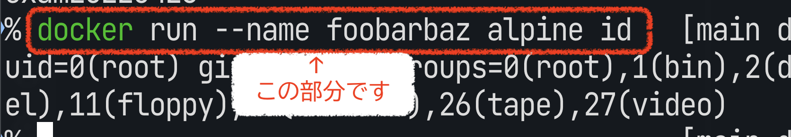

# 課題内容

Dockerがちゃんと入ったかを検証してみましょう。
そしてDockerに対する指示をコマンドで出せるかの基本を確認しておきましょう。

提出するファイルが3つあります。
全てできなくても個別で採点(各1点、合計3点)されるので、可能な限り提出してください。期限内に提出した最後の提出に対する点数が評価に使われます。

##  (1)  `docker` コマンドが動くかを検証しましょう

```
$ docker run --rm hello-world
```

を実行し、いわゆるHello Worldが動くことを確認して下さい。
既に実施していると思うので、これは問題ないでしょう。
そして出力内容を保存して下さい。
保存先ファイル名は `result-1.txt` としてください。

保存にはリダイレクトを使うといいでしょう。

```bash
# zsh, bash
% docker run --rm hello-world > result-1.txt
```

PowerShellを使っている場合、リダイレクトで内容が壊れることがあるので、パイプ渡しで `Out-File` コマンドレットを使って対応してください(下の例を参照)。

```pwsh
PS> docker run --rm hello-world | Out-File result-1.txt
```

結果ファイル `result-1.txt` をこのワークツリーにadd,commitして提出(push)してください。
提出先ではこのファイル名固定で内容をチェックして判定するので、ファイル名のミスに注意してください。

## (2) コマンドを走らせてみよう

イメージ alpine を使用し、コンテナ内で `cat /etc/hosts` コマンドを実行してください。
出力を同様に `result-2.txt` に保存・提出してください。

## (3) 名前付きコンテナを生成してみよう

イメージ alpine を使用し、名前付きコンテナ `exam20220426` のもとで `hostname` コマンドを走らせてみましょう。

このときのコマンドラインをファイル `result-3.txt` に保存・提出してください。具体的な場所がわかりにくいと思うので画像を添付します(あくまでサンプル、画像から手打ちで写した場合はNGとなります)。

